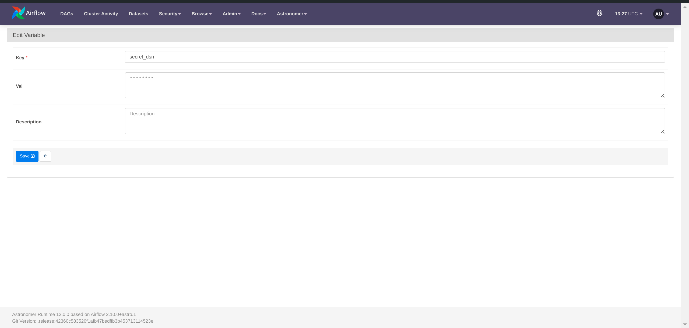

# SwapSmart Analytics

**SwapSmart Analytics** is a comprehensive end-to-end DBT Core analytics solution designed for EV companies focused on battery swapping in East Africa. This project aims to optimize operational efficiency and enhance customer experience by leveraging data-driven insights, specifically for the battery swapping model where clients exchange depleted batteries for fully charged ones.

## Key Technologies and Tools

- **Apache Airflow (Astro)**: For orchestrating data pipelines
- **Soda**: For ensuring data quality
- **DBT**: For transforming and modeling data
- **Python**: For generating synthetic data
- **Metabase**: For visualizing insights

## Visualizations

 

## Airflow Dags




## Soda Checks


## Data Modelling


## Getting Started

1. Clone the repository:

    ```bash
    git clone https://github.com/Afrawles/SwapSmart-Analytics.git
    ```

2. Navigate into the project directory:

    ```bash
    cd SwapSmart-Analytics
    ```

### Prerequisites

1. Rename the example configuration file:

    ```bash
    mv include/soda/configuration.yaml.example include/soda/configuration.yaml
    ```

2. Set up Soda account via [Soda Cloud](https://cloud.soda.io/) to monitor quality checks in the pipeline.
    - Click on your profile and create API Keys.
    - Paste the output into `include/soda/configuration.yaml`.

3. Start Astro and Airflow:

    ```bash
    astro dev start
    ```

4. Open a bash shell in the Astro container:

    ```bash
    astro dev bash
    ```

5. Navigate to the DBT directory, install dependencies, and exit:

    ```bash
    cd include/dbt/
    dbt deps
    exit
    ```

6. Access Airflow UI at: `http://localhost:8080`
    - Setup Postgres Variables `Admin > Variables > Add New Record then fill form > Save`
    - Run the `generate_data` DAG
    - Run the `dw_bt` DAG

7. Access Metabase at: `http://localhost:3000` or use the IP found in Docker:
    - Inspect the container for the IP address using `docker inspect <container-name>` and look under `Networks` to get the `IPAddress`.

8. Set up DB connection in Metabase and build dashboards using the report tables.

## Resources

- YouTube Channel: [Marc Lamberti](https://youtu.be/DzxtCxi4YaA)
- Connecting Metabase to PostgreSQL - 2 Docker Containers: [Metabase Forum](https://discourse.metabase.com/t/connecting-metabase-to-postgresql-2-docker-containers/128002)

## Contributing

Contributions to improve the data model, add analytical queries, or enhance workflows are welcome. Please fork the repository, make your changes, and submit a pull request.

## License


## Contact

For questions or feedback regarding SwapSmart Analytics, please contact Odeke at `afrawles@outlook.com`.

- [LinkedIn](https://www.linkedin.com/in/mosesodeke/)
- [GitLab Profile](https://gitlab.com/mosesafrawles)
- [Portfolio](https://mosesafrawles.gitlab.io/portfolioui/)
